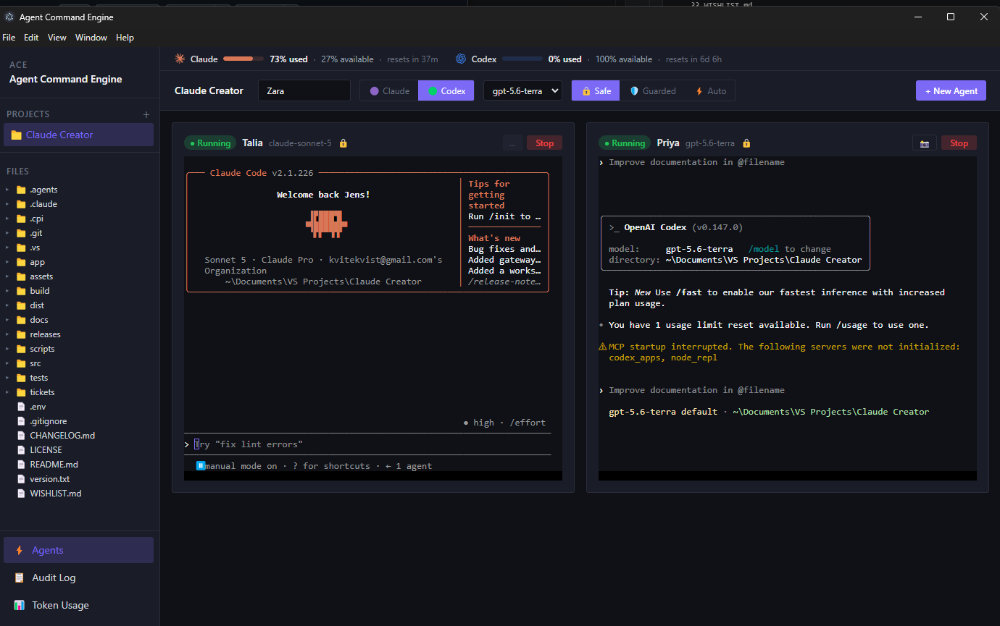
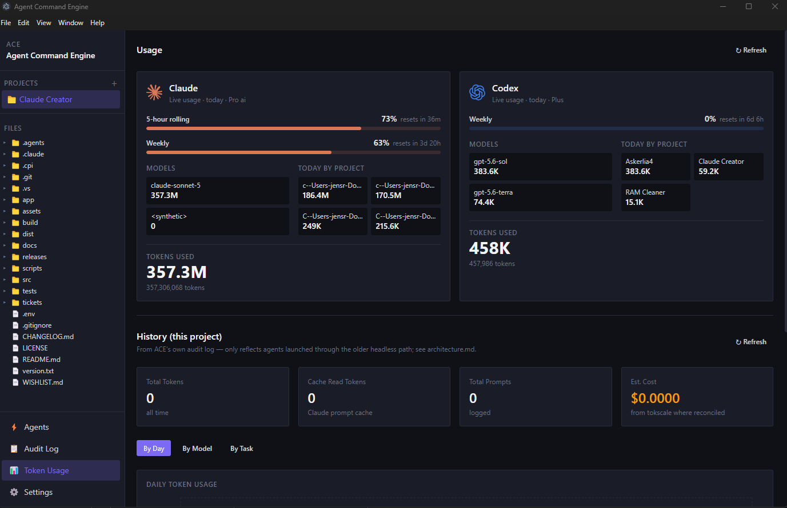

# Agent Command Engine (ACE)

ACE runs Claude Code and Codex agents in separate terminals for each project. It keeps their tasks, status, and usage data together.
---

## Screenshots

**Agent Interface** - multi-agent runner with real interactive terminals per project



**Usage** - live token usage dashboard across Claude and Codex



---

## Features

- **Projects** — Open and switch between project folders.
- **Files** — Browse a project in a VS Code-style sidebar. Edit files in Monaco and save them to disk. The context menu can open files in Explorer or run executable files.
- **Agents** — Start several Claude Code or Codex agents in one project. Each has its own interactive terminal and remains available when you switch tabs or projects.
- **Names and status** — Agents receive a generated name and a title from their first prompt. Their badges reflect Claude Code lifecycle events: **Running**, **Waiting**, **Done**, or **Error**. A project can play a sound when an agent finishes.
- **Screenshots** — Capture a selected screen area from an agent card. ACE writes the image to `.ace/screenshots/`, adds that directory to `.gitignore`, and copies its path.
- **Usage** — The default dashboard reads Claude and Codex quota and usage data from `tokscale`. It shows reset times and today's use by model, project, and session.
- **Usage bar** — The Agents tab shows each provider's used and available percentage, plus its reset time.
- **Models** — Choose the Claude or Codex model for an agent.
- **Push update** — This terminal action creates a ticket and a `feature/` or `bugfix/` branch, makes a local commit, then opens a pull request through `/push-update`.
- **One window** — A second launch focuses the existing window instead of starting another copy of ACE.

---

## Stack

| Layer | Technology |
|---|---|
| Desktop shell | Electron |
| UI | React 18 + Tailwind CSS |
| Bundler | Vite |
| Database | SQLite via sql.js (WASM) |
| Charts | Recharts |
| State | Zustand |
| Terminal | node-pty + xterm.js |
| Editor | Monaco (`@monaco-editor/react`) |
| AI providers | Claude CLI, OpenAI Codex CLI |

---

## Install

**macOS** - installs the latest release straight into `/Applications`, no manual download:
```
curl -fsSL https://raw.githubusercontent.com/Kvitekvist/agent-command-engine/main/scripts/install-mac.sh | bash
```
Builds are unsigned, so first launch needs a right-click > Open the very first time (the script already strips the quarantine flag, so this is a one-time Gatekeeper confirmation, not an error).

**Windows** - download the installer or portable exe from the [latest release](https://github.com/Kvitekvist/agent-command-engine/releases/latest).

---

## Quick Start

**Windows:**
```
scripts\setup.bat   # install dependencies (run once)
scripts\run.bat     # start in development mode
scripts\build.bat   # build for production
```

**macOS / Linux:**
```
chmod +x scripts/*.sh
scripts/setup.sh    # install dependencies (run once)
scripts/run.sh      # start in development mode
scripts/build.sh    # build for production
```

Requires: Node.js 20+, Claude Code CLI (`claude`), OpenAI Codex CLI (`codex`) installed and authenticated.

Automated checks:

```
cd src
npm test
npm run build
npm run package
```

Application build output is written to `src/dist`; installers are written to `releases`.

---

## Credits

Token usage tracking is built on [token-monitor](https://github.com/Javis603/token-monitor) by [Javis603](https://github.com/Javis603).

---

## Version

See `version.txt` and `src/package.json` for the current version, and
`CHANGELOG.md` for release history. Current milestone: Reliability Alpha.
